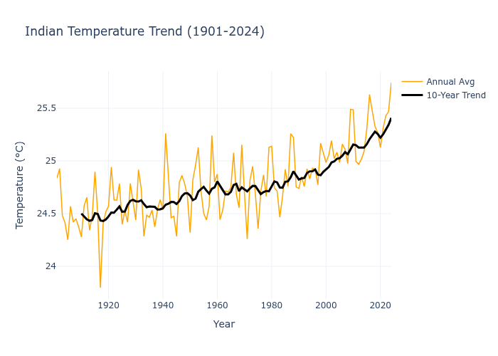
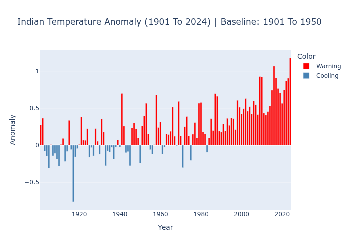

# Climate Data Analysis Report (1901–2024)

This report presents an Exploratory Data Analysis (EDA) of regional temperature changes over the past century, utilizing historical meteorological data.

---

## 1. Annual Average Temperature Trend

The chart below illustrates the annual average temperature alongside a 10-year rolling average to smooth out short-term fluctuations and highlight long-term climate behavior.

### Key Insights & Interpretation:
* **Long-Term Warming:** The visualization confirms a **sustained long-term warming trend** across the region over the last century.
* **Rolling Average Analysis:** While year-to-year temperature values (the orange line) show significant natural variability, the **10-year rolling trend (the black line)** provides a clear, smooth upward trajectory.
* **Conclusion:** There is a distinct, consistent rise in average temperatures, indicating that the regional baseline temperature has shifted notably higher, especially from the late 20th century onwards.

---

## 2. Temperature Anomaly Analysis

The anomaly chart displays deviations from the historical baseline period (1901–1950). Warm anomalies are highlighted in red (Warning), while cooler-than-average years are shown in blue (Cooling).

### Key Insights & Interpretation:
* **Shift in Baseline:** The frequency and intensity of **"Warning" (above-average) years** have increased dramatically in the recent era compared to the 1901–1950 baseline.
* **Decadal Contrast:** 
  * The early decades of the 20th century were dominated by **Cooling trends (blue bars)**, aligning with the historical average.
  * Conversely, the last 3 to 4 decades display a stark dominance of **Warning trends (red bars)**, signifying that recent years are consistently warmer than historical normals.
* **Conclusion:** This transition from a balanced distribution of cool/warm anomalies to a heavy concentration of warm anomalies serves as a strong, undeniable indicator of regional climate change.

---
*Report generated using Python, Pandas, and Plotly Graph Objects.*